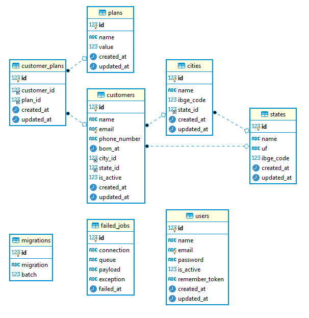

# Desafio Origo Energia Nov/2020

#### Informações básicas

- Desenvolvido com Apache/2.4.39, PHP 7.3.7, Laravel 7.29.3, MariaDB 10.3.16 e Composer
- Criar database `laravel_um` ou alterar o nome do banco de dados no arquivo `.env`

Seguir os passos para instalação:

### Criar projeto

\$ git clone https://github.com/ricardohmfilho/laravel-um.git

\$ cd laravel-um/backend

\$ composer install

### Migrate

\$ php artisan migrate

### Seed

\$ php artisan db:seed

* Os dados dos `clientes` foram extraídos e tratados por script Python (`/command/extract_data.py`) do PDF enviado, exportados para formato `json`, no arquivo `/backend/database/data/customer_data.json`.

### Diagrama do banco de dados

### Habilitar o passport (usado para autenticação)

\$ php artisan passport:install

\$ php artisan passport:keys --force

### Iniciar aplicação

\$ php artisan serve

### Limpeza de cache (se necessário)

\$ php artisan cache:clear

\$ php artisan config:clear

\$ composer dump-autoload

### Testes

Um teste simples foi criado, para rodá-lo basta executar um dos comandos:

\$ php artisan test

\$ composer test

## Documentação das rotas da API

\$ php artisan route:list

Para visualizar a documentação completa das rotas elaborada no postman, acesse o link [Postman](https://documenter.getpostman.com/view/1636800/TVCY5rSw)

> Obs:

- Os posts e put de dados, foram feitos na tab `body`, na opção `x-www-form-urlencoded`;
- A url base usada foi a `http://127.0.0.1:8000` criada pelo comando `php artisan serve`.

| Method | URI                                          | Action                                   |
| ------ | -------------------------------------------- | ---------------------------------------- |
| POST   | api/register                                 | AuthController@register                  |
| POST   | api/login                                    | AuthController@login                     |
| POST   | api/logout                                   | AuthController@logout                    |
| GET    | api/users                                    | UserController@index                     |
| GET    | api/users/{id}                               | UserController@show                      |
| PUT    | api/users/{id}                               | UserController@put                       |
| DELETE | api/users/{id}                               | UserController@delete                    |
| GET    | api/operations                               | OperationController@index                |
| GET    | api/account_transactions/user                | AccountTransactionController@listAccount |
| GET    | api/account_transactions/totalizer/{user_id} | AccountTransactionController@totalizer   |
| GET    | api/account_transactions/report              | AccountTransactionController@report      |
| POST   | api/account_transactions                     | AccountTransactionController@store       |
| DELETE | api/account_transactions/{id}/{user_id}      | AccountTransactionController@destroy     |
